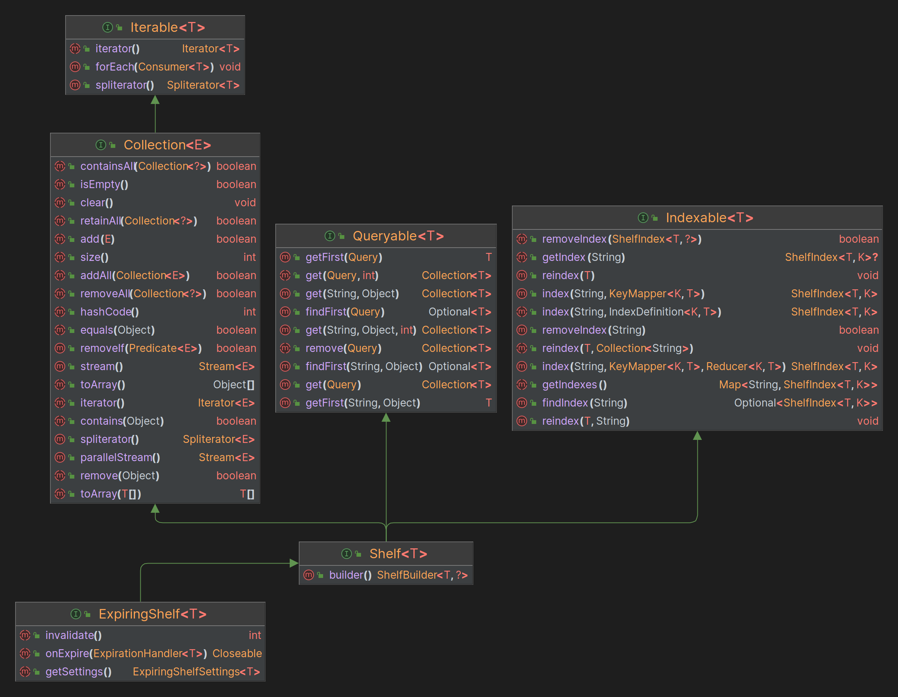

# Shelftor


This library gives you in memory database that you can use as a cache layer between db -> application  
It can be also used in other scenarios where you need to store data by indexes and retrieve it by them.

This is a complete recode of previously forked [memory-store](https://github.com/OOP-778/memory-store)

## Usage
Shelftor is hosted at maven central.   
To add it to your dependencies follow the guide depending on your build tool
### Maven
```maven
 <dependency>
    <groupId>dev.oop778.shelftor/groupId>
    <artifactId>shelftor-api/shelftor-core</artifactId>
    <version><version></version>
 </dependency>
```
### Gradle
```gradle
implementation 'dev.oop778.shelftor:shelftor-api/shelftor-core:<version>'
```

### Queries
Shelftor comes with a very powerful querying system, it gives you the flexibility to adapt to any database. And can be used a query 
system for database of your use with some adaptation.

```java
// Let's create a simple indexed query by username=OOP_778
 Query.where("username", "OOP_778");

// Now Let's merge it with another query that is indexed by age=20
Query.where("username", "OOP_778").and("age", 20);

// Now let's say we want to find two users with username=OOP_778 and username=OOP_779
Query.where("username", "OOP_778").or("username", "OOP_779");

// That's it, the query system is simple yet powerful
```

### Shelf Types
Shelftor comes with 2 types of shelfs that you can use, let's dig deeper into them.
```java
// Default shelf is a non expiring one
Shelf.<User>builder()
    // By default shelftor uses identity hashes, but you can change it to use hashcode instead
    .hashable()
    // By default shelftor collection choice is non concurrent to avoid any performance hit when used on a single thread environment
    // But you can change it to be concurrent if you want to use it in a multi threaded environment
    .concurrent()
    // By default shelftor uses strong references, meanining that it won't allow GC to run on it's values,
    // You can change that to weak references using
    .weak()
    // Build the shelf
    .build()
    
// Expiring shelf is a shelf that expires it's cache after specific demands are met
Shelf.<User>builder().expiring()
    // All options from the default shelf are available here
    // By default shelftor expiring shelfs do expiration when you fetch values from it, but you can change that to be done in a 
    // background thread
    .expireCheckInterval(long interval, TimeUnit unit)
    // You need to define expiring policies for values to be expired
    // Wel'll talk about expiring policies later
    .usePolicy(ExpiringPolicy policy)
```

#### Expiring Policies
Shelftor Expiring shelf comes with 2 expiring policy types `ExpiringPolicy` and `ExpiringPolicyWithData`

In simple words `ExpiringPolicy` does not store any data on each value and does checks based on the value itself
whilst `ExpiringPolicyWithData` stores data on the values to know when to expire.

Example of that is `TimedExpiringPolicy` located at `api/src/main/java/dev/oop778/shelftor/api/expiring/policy/implementation/TimedExpiringPolicy`


### Indexes
You can define indexes of two types collection and single
Let's say we have a Student object that has name (String) & grades (Collection<Integer>)

```java
record Student(String name, Collection<Integer> grades) {}

// Now let's create a shelf for students
Shelf<Student> shelf = Shelf.<Student>builder()
    .build();

// Now let's define an index for name
shelf.index("name", Student::name);

// Now let's define an index for grades
shelf.index("grades", IndexDefinition.withKeyMappings(Student::getGrades))

// Now let's create two stdudents
Student student = new Student("OOP_778", List.of(5, 6, 7));
Student student2 = new Student("OOP_779", List.of(5, 6, 7));

// Now let's put them in the shelf
shelf.add(student);
shelf.add(student2);

// Now we can fetch them by grade of 5
shelf.get("grades", 5); // This returns us both students

// Now let's say one student grades changes
student.grades().add(8);

// We need to reindex that student
shelf.reindex(student, "grades");

// That's it, now you should be able to properly understand the full power of shelftor

```

### Shelf Diagram
